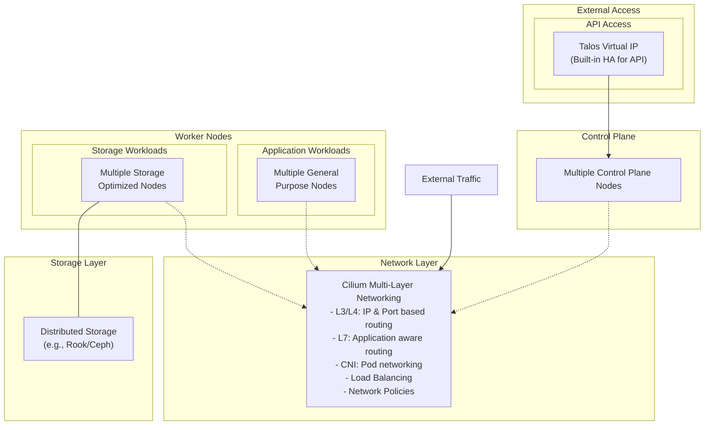

# Grass

My own cloud

###

### local docker setup

we use the `cp-base.yaml` patch as base configuration patch when creating and we also turn o k8s node ready check as this will fail as we are turning of CNI

    talosctl cluster create --config-patch @cp-base.yaml --skip-k8s-node-readiness-check

then we only need to install cilium

    helm install cilium \
    cilium/cilium \
    --version 1.16.5 \
    --namespace kube-system \
    --set ipam.mode=kubernetes \
    --set kubeProxyReplacement=false \
    --set securityContext.capabilities.ciliumAgent="{CHOWN,KILL,NET_ADMIN,NET_RAW,IPC_LOCK,SYS_ADMIN,SYS_RESOURCE,DAC_OVERRIDE,FOWNER,SETGID,SETUID}" \
    --set securityContext.capabilities.cleanCiliumState="{NET_ADMIN,SYS_ADMIN,SYS_RESOURCE}" \
    --set cgroup.autoMount.enabled=false \
    --set cgroup.hostRoot=/sys/fs/cgroup \
    --set k8sServiceHost=localhost \
    --set k8sServicePort=7445

check if pods are running:

    kubectl -n kube-system get pods
